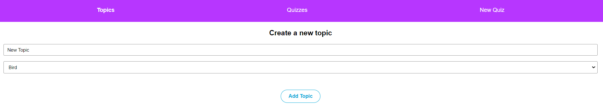
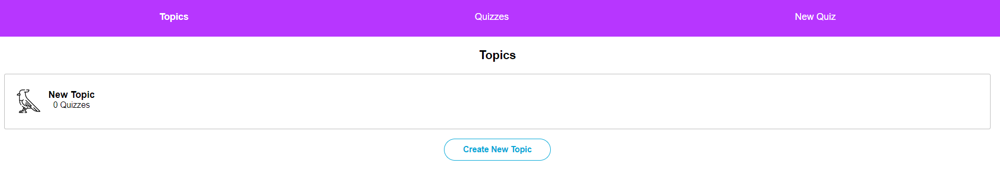
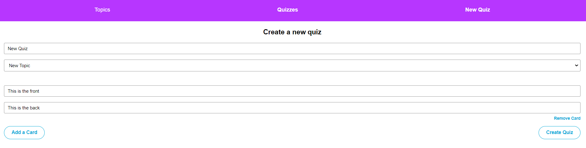
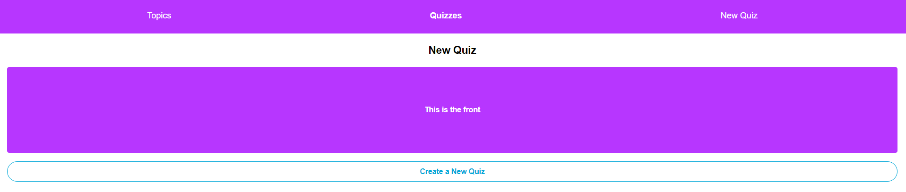
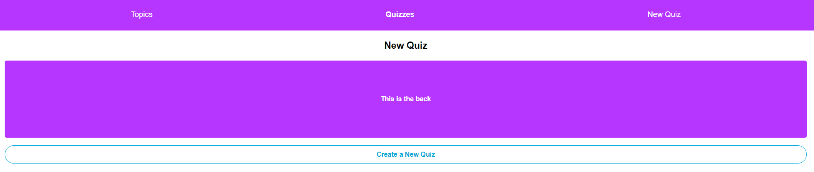
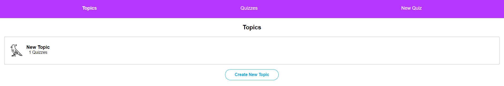
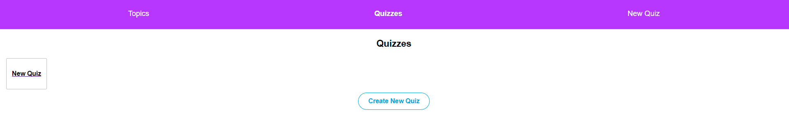

# Flashcard App

Flashcard App is a simple web application for creating and managing flashcards and quizzes. It is built using React and Redux Toolkit, making it easy to organize topics, cards, and quizzes.

Users are able to create their own topics, quizzes for those topics, and flashcards for those quizzes. 
Users are also able to interact with their quizzes by flipping flashcards over.

## Table of Contents

- [Features](#features)
- [Creating Topics](#creating-topics)
- [Creating Quizzes](#creating-quizzes)
- [Cards](#cards)
- [Overview](#overview)
- [Getting Started](#getting-started)
- [Usage](#usage)

## Features

- **Topics Management:** Create topics.
- **Quizzes:** Create quizzes for specific topics.
- **Cards:** Add flashcards to quizzes with a front and back side.
- **Redux Integration:** State management is handled using Redux Toolkit for a predictable and manageable state.

## Creating Topics
### Topics

### Create Topics

### Created Topics


## Creating Quizzes


## Cards
Clicking on a card will show toggle between card front and back.
### Front

### Back


## Overview
After the creation of a topic and a quiz with cards they are depicted in the respective overviews:
### Topics overview

### Quiz overview



## Getting Started

These instructions will help you get a copy of the project up and running on your local machine for development and testing purposes.

### Prerequisites

Before you start, ensure you have the following software and tools installed:

- [Node.js and npm](https://nodejs.org/)
- [Git](https://git-scm.com/)

### Installation

1. Clone the repository:

   ```bash
   git clone https://github.com/yourusername/flashcard-app.git
   ```

2. Change to the project directory:

   ```bash
   cd flashcard-app
   ```

3. Install project dependencies:

   ```bash
   npm install
   ```

### Running the App

1. Start the development server:

   ```bash
   npm start
   ```

2. Open your web browser and visit [http://localhost:3000](http://localhost:3000) to access the Flashcard App.

## Usage

The Flashcard App is a user-friendly interface for creating and managing flashcards and quizzes. Here's how you can use it:

1. Create Topics:
   - Click the "Add Topic" button.
   - Enter a topic name and choose an icon.
   - Click "Add Topic" to create a new topic.

2. Add Quiz with Flashcards:
   - Select a topic from the sidebar.
   - Click "Add Card" in the topic view.
   - Enter the front and back of the flashcard.
   - Click "Create Quiz" to add the flashcard to the topic.


